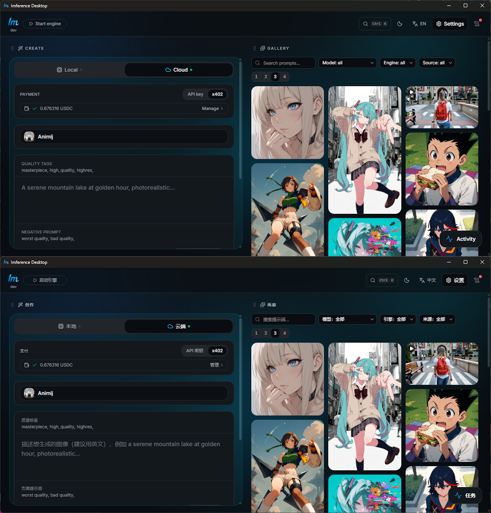

The translation itself took minutes. Verifying it found a bug that had been sitting in my app all along — in English too.

## Why bother

While researching where local AI inference is actually popular, I kept running into the same answer: China. It makes sense — capable consumer GPUs, a strong self-hosting culture, a healthy distrust of cloud services. It's also a market that's structurally out of reach for Western cloud SaaS... but not for an open-source desktop app. Nothing to host, nothing to bill, nothing to block.

So the math looked like this: potential upside — access to one of the largest local-inference communities in the world; cost — an afternoon. I don't speak a word of Chinese. I did it anyway.

[Imference Desktop](link) is a local-first image generation app. There isn't that much text in it — buttons, labels, settings, error messages. I asked Claude to translate the locale file. That's the part everyone imagines is hard. It isn't.

*Same screen, two audiences — English on top, Chinese below.*

## The parts that actually needed thought

**Some strings don't live where you think they do.** My format labels ("Portrait Large", "Landscape Ultra-Wide"...) come from the server's model catalog, not from the app's locale files. Result: the format bar showed up half-translated — three Chinese labels followed by six English ones — because only the strings that existed as i18n keys got translated. Localization coverage is an architecture question before it's a language question.

**Some things must NOT be translated.** Model names stay in English — even Chinese users say "Flux" and "SDXL". Translating them would have made the app *harder* to use. Knowing what to leave alone matters as much as translating the rest.

**Localization is adaptation, not conversion.** The Chinese prompt placeholder doesn't say what the English one says. It adds a piece of advice the English version doesn't need: "describe the image you want (English recommended), e.g. ...". Most image models are trained predominantly on English captions; a Chinese user typing a Chinese prompt gets worse results through no fault of their own. The translation that serves the user diverges from the source on purpose.

## Verifying what you can't read

Here's the uncomfortable part. When the translation came back, I was looking at strings I could not evaluate at all. For all I knew, my "Cancel" button said something embarrassing.

My review pipeline, fully honest version:

1. I took paired screenshots of every screen — English and Chinese side by side.
2. I fed them to a *fresh* Claude session, in incognito mode, with no memory of my app and no stake in defending its own translation, and asked for an element-by-element comparison.
3. It came back with a structured review: most of the translation judged idiomatic and faithful, the half-translated format bar flagged, two wording refinements suggested (a clearer per-generation credits label, a VRAM-vs-memory inconsistency in a settings subtitle), and one question — "your Chinese placeholder diverges from the English one, is that intentional?"
4. I fed that review to Claude Code, which traced each finding to the actual cause in the codebase and implemented the fixes.

My job in all this was arbitration, not translation: keep the divergent placeholder (intentional), pick the Chinese naming scheme for the extended formats, decide where to fix what. The pipeline was AI end to end — translator, reviewer, implementer — with a human making the three or four judgment calls that actually required one.

## The review found a bug in my app

This is the part I didn't see coming. Comparing the two languages element by element, the reviewer noticed something off that had nothing to do with Chinese: my aspect ratios were backwards. A 896×1152 portrait format was labeled "9:7" — a landscape ratio. Checked against the API: systematic, every image format in the catalog ships its ratio string inverted. In production. In both languages. Nobody had ever reported it — including me, who had looked at that format bar hundreds of times.

The fix was a ten-line client-side normalization (trust the dimensions, flip the string when its orientation disagrees). The lesson is bigger: **a careful localization review is a free QA pass.** Fresh eyes — even artificial ones — forced to compare two renderings of the same UI element by element will catch things you've stopped seeing. The Chinese translation improved my English app.

## What I'd tell other indie devs

AI has collapsed the cost of localization. What used to require an agency, a budget and weeks now takes an afternoon — *for the right kind of product*. Two honest caveats:

- This works because my app has little text and low stakes. I would not ship an AI-only translation for legal copy, medical content, or marketing where tone is everything.
- The translation is the cheap part. The verification pipeline and the public honesty are what make it shippable. My Chinese README says it plainly: translated with AI assistance by a dev who doesn't speak Chinese — corrections welcome via PR. That one line turns my biggest weakness into a contribution funnel.

The asymmetry is what matters: an afternoon of work for access to a market I couldn't otherwise touch. Even if it only ever brings a handful of users and a few translation-fixing PRs, it already paid for itself — it found a bug my own eyes never would have.

*[Addendum slot — 3 weeks later: X stars from China, Y issues in Chinese, Z translation corrections received.]*
